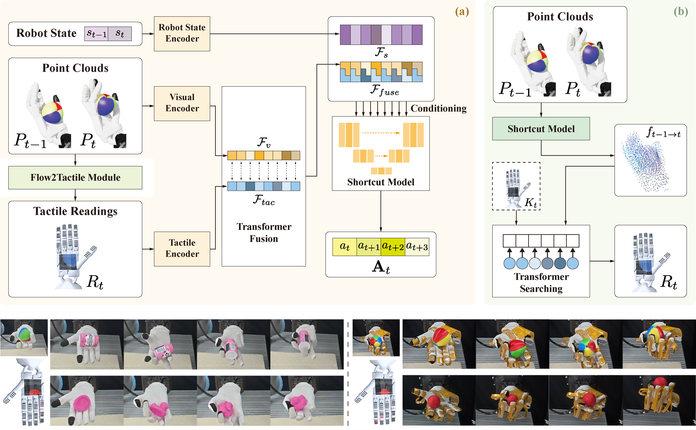

# <a href="https://sites.google.com/view/dex-fbi">Flow Before Imitation: Learning Dexterous In-hand Manipulation with Dynamic Visuotactile Shortcut Policy</a>

<a href="https://sites.google.com/view/dex-fbi"><strong>Project Page</strong></a>
  |
    <a href="https://ieeexplore.ieee.org/abstract/document/11696089"><strong>paper</strong></a>
    |

  Yijin Chen∗, Wenqiang Xu∗, Zhenjun Yu, Tutian Tang, Yutong Li, Siqiong Yao, Cewu Lu


**IEEE International Conference on Robotics & Automation (ICRA) 2026**


<div align="center">
  
</div>

**Flow Before Imitation (FBI)** is a visuotactile shortcut imitation learning framework for dexterous in-hand manipulation that establishes a causal link between tactile signals and visual cues. It enables dexterous hands to achieve complex in-hand manipulation tasks such as in-hand reorientation and in-hand rotation, and outperforms state-of-the-art baselines in both simulation and the real world on these two customized in-hand manipulation tasks and three standard dexterous manipulation tasks.

# 📝 Citation

If you find our work useful, please consider citing:
```
@INPROCEEDINGS{11696089,
  author={Chen, Yijin and Xu, Wenqiang and Yu, Zhenjun and Tang, Tutian and Li, Yutong and Yao, Siqiong and Lu, Cewu},
  booktitle={2026 IEEE International Conference on Robotics and Automation (ICRA)}, 
  title={Flow Before Imitation: Learning Dexterous In-hand Manipulation with Dynamic Visuotactile Shortcut Policy}, 
  year={2026},
  volume={},
  number={},
  pages={12514-12521},
  keywords={Color;Hands;Modeling;Contacts;Printing;Fluid flow;Visual systems;Visualization;Clouds;Modules (abstract algebra)},
  doi={10.1109/ICRA57385.2026.11696089}}

```


# Getting Started
Please refer to [Getting_Started.md](Getting_Started.md) for installation and usage instructions.


