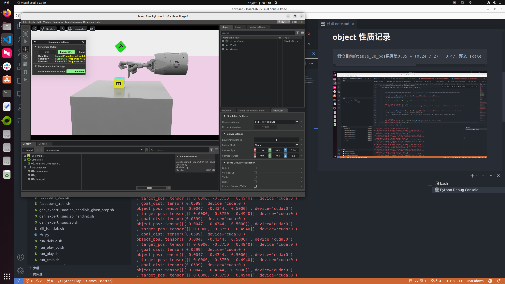
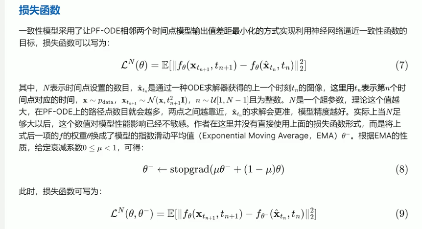
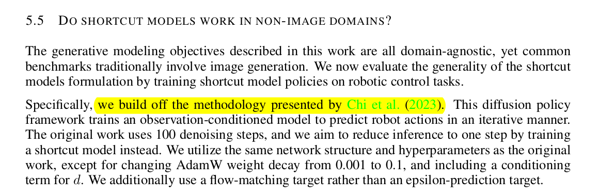
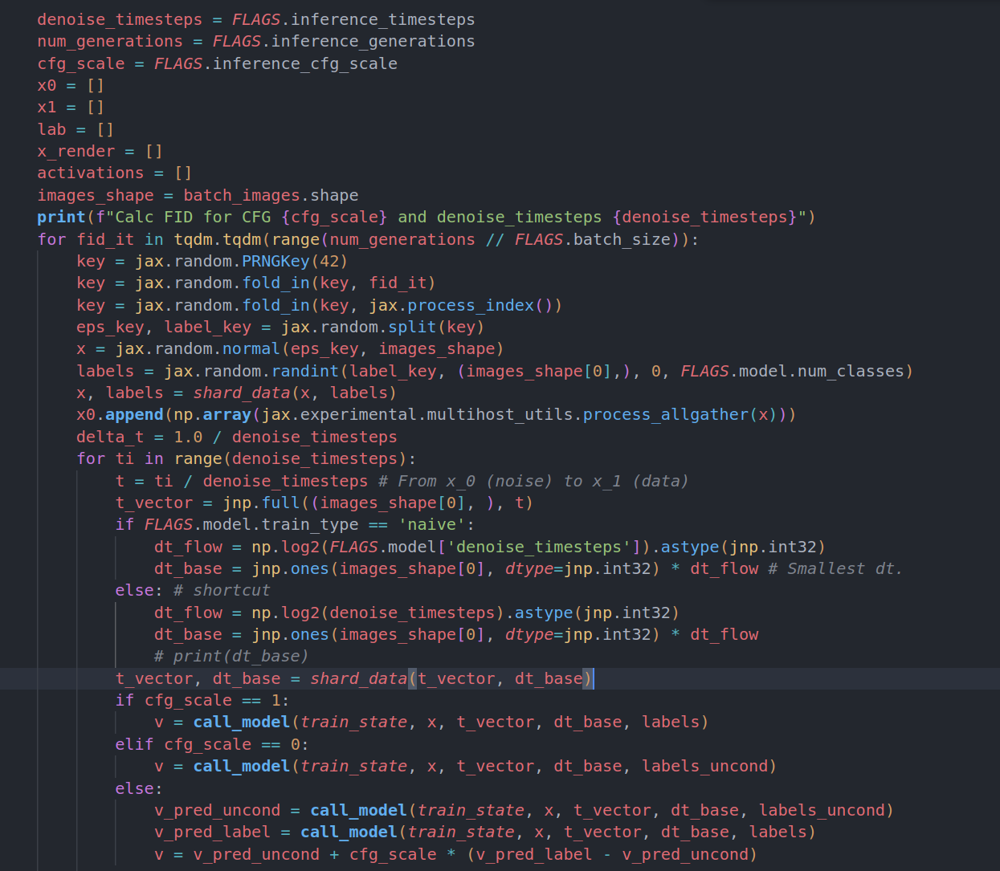
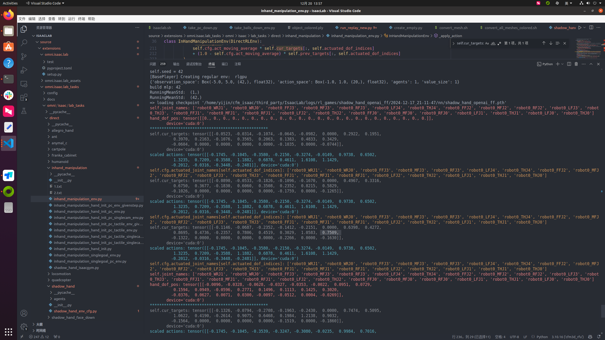
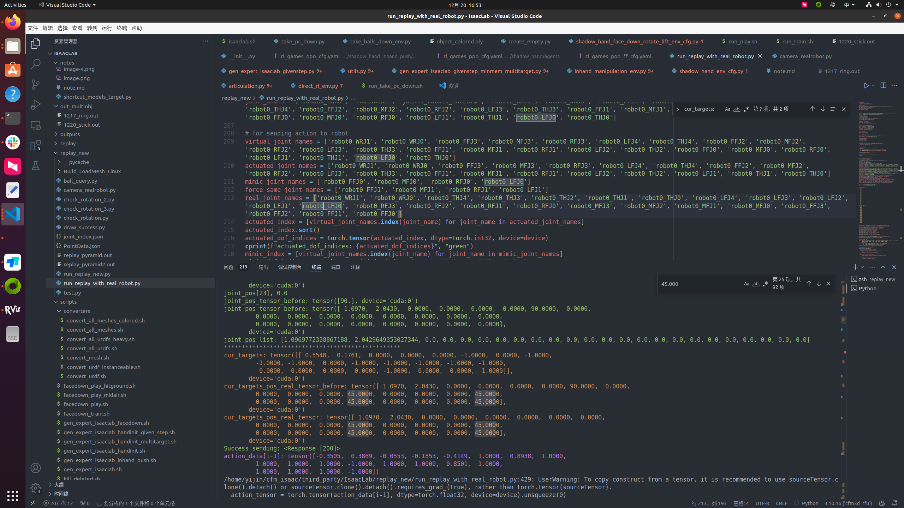
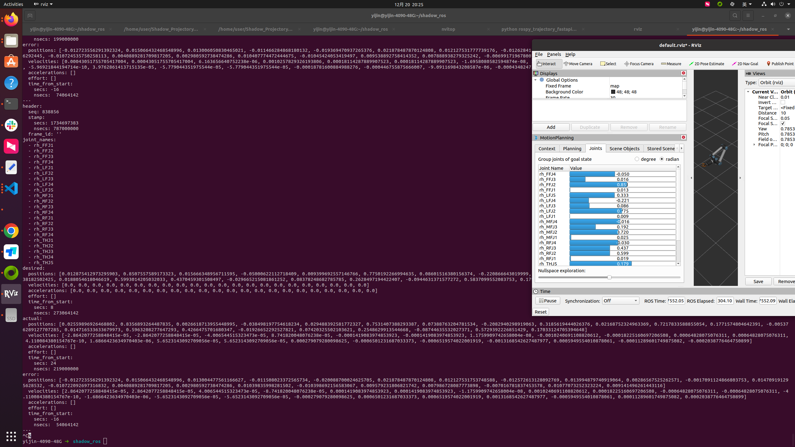

# event_cfg 改物体配置记录
    1. 入口
    events: OntableEventCfg = OntableEventCfg()
    2.在direct_rl_env里面有这样的描述
    if self.cfg.events:
        self.event_manager = EventManager(self.cfg.events, self)
        print("[INFO] Event Manager: ", self.event_manager)
    
    可能可以参考openAIManiCube里面的event_config来修改interactive_env里面的东西

    3.  friction确实有用，如果手设置成0.0抓不起来，反之可以抓起来，同理cube如果光滑会飞起来
    4. 目前暂时不清楚物体那个弹性恢复的作用，但设置过之后物体会变弹

# object 性质记录
    假设目前的table_up_pos果真是0.35 + (0.24 / 2) = 0.47，那么 scale = (1., 1., 1.)的object在平放的时候，边长为0.03,因为obj_pos是
, 对角线最多也是0.03 * sqrt(3) = 0.05196, so 0.06, 0.07, 0.08应该完全够了
    已经基本证实了,因为把scale变成0.65的时候,平放桌面的高度就是0.3 * 0.65 = 0.195 + table_top,所以半边长应该就是0.3

# Info.txt里面有一些调试记录，直接搜索info.txt就可以找到

# Three Staged-RL: 
    Between stages: 
    1. change the ckpt in bash script
    2. change the "stage" variant in the config file  (The stage will be changed when running evalidations cuz the suceess conditions are not the same)
    3. change the "max episode" variant in the ppo_cfg file
可以在logs/.../env.yaml里面查看stage

# 有一个std must >= 0的error
    我猜测是因为模型收敛到，可能没梯度了，所以可能就自动终止了，应该不是程序的问题，估计用的什么ppo惩罚，截断什么的，所以不允许std == 0

# Isaaclab usd and file loadings: 今天记录一些经验：
ground的材质可以改，但暂时没测试过如果改成invisible，会不会对相机有影响. 

由于这个isaaclab的 ground (还有早上找到的一些seattle table什么的) 都没有ridge body的属性(通过检查config，还有schema.py发现，只有prim.hasridgebodyAPI，才可以给他加入contact force sensor， 同时也只有ridge body config里面有activate contact forces的属性)，所以它们目前不能被加入contact force buffer里面，从而检测地面碰撞的事情就行不通了，除非我之前找到一个workaround的解决方案是cube上面lei cube，但是这样摩擦系数什么的就又不对了，所以暂时作罢，除非之后找到一个可以当作ridge body的东西拿来做table(好像visual dexterity里面就是这样干的，看下面的图，是用generate box，并且那个kinematic = False来充当桌子，然后设置friction什么的，但这样太麻烦了，暂时还是用坐标来判断是否接触地面吧)

# 在环境中添加相机的办法：
先随便用cameracfg写一个相机，然后进环境以后把视角调过去，再直接动数字就行，可以用isaaclab本身带的，也可以用XYZ转的，是一样的

# Rsync
    rsync -avz /home/yijin/cfm_isaac/3D-Conditional-Flow-Matching/data/outputs_cfm/isaaclab_cube_tactile-cfm3d_tactile-1019_handinit_openai_6K_randomreset_singlecam_seed0/checkpoints/latest.ckpt jeffsonyu@10.53.21.50:/home/jeffsonyu/cfm_isaac/3D-Conditional-Flow-Matching/data/out_cfm/isaaclab_cube_tactile-cfm3d_tactile-1019_handinit_openai_6K_randomreset_singlecam_seed0

    rsync -avz /home/yijin/cfm_isaac/3D-Conditional-Flow-Matching/data/isaaclab_pyramid_expertinhand_reorient_pyramid_colored_backup.zarr yijin@robot03:/mnt/homes/yijin/cfm_isaac/3D-Conditional-Flow-Matching/data/

    rsync -avz yijin@robot03:/mnt/homes/yijin/cfm_isaac/3D-Conditional-Flow-Matching/data/isaaclab_vase_expertinhand_reorient_vase_colored_rich_contact.zarr /home/yijin/cfm_isaac/3D-Conditional-Flow-Matching/data/

    mkdir -p ~/cfm_isaac/3D-Conditional-Flow-Matching/data/outputs_cfm/isaaclab_cube_tactile-cfm3d_shortcut-1208_8base_seed0/
    rsync -avz yijin@robot03:/mnt/homes/yijin/cfm_isaac/3D-Conditional-Flow-Matching/data/out_shortcut/isaaclab_cube_tactile-cfm3d_shortcut-1208_8base_seed0/checkpoints/249.ckpt /home/yijin/cfm_isaac/3D-Conditional-Flow-Matching/data/outputs_cfm/isaaclab_cube_tactile-cfm3d_shortcut-1208_8base_seed0/checkpoints/

# 10.31记录
    其实感觉end state里面的action norm可以关掉的，感觉它是引起比如中指平伸的原因，不过其实本身就有action penalty，我不知道是否有用

    回复，没加action norm!, 这个行为估计只是从action penalty学的

# 11.4 记录
    .... 它isaaclab这个东西我草... 我真的怀疑是这样的，它的visualize呢，估计是第一步只更新那些ridge body，第二步只更新那些contact sensor，第三步才更新那些visual markers，包括contact force 的 debug_vis, 还有visual_marker，我有做过实验，也不是因为一开始range了三次有buffer，需要再三次才覆盖什么的，他他M的就是需要三次才能render出来，如果我把reset_idx那里的render只来一遍的话，它在render第三次的时候会直接赶上当前的进度，抛开中间的动作，比如reset_idx render 一次，此时visualize marker没来，然后光照还是模糊的，然后直到第三次执行render，会突然抽风一样，图片清晰，marker出现，并且执行了中间那一些action.... 不懂，可能真的和render level有关...

# 11.8
已知就是在stage2的时候，如果hit_ground变成负数会导致nan的问题(也可能和fall_dist有关)，目前采用的办法是把cube那边的拿来直接微调，后面的话我估计是可以从hit_ground来着手的，看看设成0.0行不行
主要坏就坏在我测试过0.0000001,感觉训不起来

# 11.10
act-moving-average感觉没啥用，用处不大反正，1.0能转的，0.3其实也基本能转，只是有些情况会掉落，最多再多训个几个epoch重新收数据就行了
另外感觉，它那个仿真的时候飞出去的现象，是碰撞的问题，感觉和物体的轻重，没有太大的关系，可能它们以一个很大的速度分离了就会这样
恩不过用openai那个环境的化，对act-moving-avg就敏感一些，猜测是它的simulation dt 大 且 decimation多的原因

# 11.13
!!!!! 注意 注意,在测试6K的时候,由于之前训的是n_actions = 2, 所以要记得改一下,然后那个single_cam的相机应该是没问题的，反正我看点云和rollout都挺对，但是可能窗口上面render就有点差别这样

记得！记得！记得那个那个，在后面train_mug的时候要检查cfm_3d里面是否做了force_norm， 哦不过如果不做也训不起来，问题不大

# 11.16
有一些模型上面的问题，就是 DDPM 和 DDIM 的前向和后向过程好像都是 SDE 过程， DDIM能跳步是因为是其非马尔可夫的前向过程设计，然后DDIM只是去噪的时候把某个sigma = 0而已，但去噪过程还是SDE，flow-matching的整个都是建立在ODE上面，随机性应该只来自于x0 和 x1的对应关系，consistency model是把模型去噪的过程转为 ODE过程(PF-ODE)，而加噪的过程还是SDE过程

CM损失函数：相邻两个时刻的“投影”什么的相似：

注意CM中的假设是去噪过程中的每一个点都落在pf-ode路径上面

# 11.18 
success 的错误是因为环境中的decimation是3,但是呢，在isaaclab_runner里面，nobs_step是2,这就导致如果在 obs[0]的地方胜利的话，会被漏掉

# 11.20
昨天使用convert_mesh.py的时候发现，使用58008.obj的话，会出现"prim path must be absolute path"的错误，改成model.obj能解决，原因暂时未知

# 11.29
shortcut model里面的dt, 论文里面写的是 <0 的，也就是1/2, 1/4, ...这样，但实际传进去的是dt_base，也就是2, 4, 8这样，但其实感觉也不大影响，它应该是想突出dt的影响，让它在不同的dt_base下的表现有非常的不同？
本来论文里面说的就是dt_base 就是 dt_bootstrap_base 有一个两倍关系把，比如如果它把最小单元堪称1 / 128 的话那么shortcut的单元就应该是1 / 64, 差不多就是这个7,8的关系，所以说，我当然也可以把dt_base变成什么7和8, 或者 1 / 2**7, 1/2**8也是没问题的

stopgrad(xxx, xxx, /2) 的意思是，stopgrad()作用域内的向量不参与梯度的计算，就是说算的时候把它搞成model.eval()就行? 至少在shortcut_model的代码里面是这样做的

!!!!!! 感觉是这样子的，他那个shortcut_model阿，有点像就是说，用7/8的时候正常学，也就是学模型性能，学flow matching target，然后同时用1/8的时候来学那些"shortcut"，也就是把那些位于bootstrap_t(1/128, ...) 的点的方向学到t (1/64, ...)上面去，应该是这个意思 

# 11.30

关于shortcut model t_full = t[:, None, None, None] 的解释：因为它预测的是一个rgb图片，形状应该是(B, C, H, W), 而我们用作policy的话只相当于是1-dim picture，所以只需要两个None就可以了

之前还是有点误会了，如果推断的时候,inference_step = 1的话，那么dt_base应该相应地等于0，这也就是"shortcut"的意义所在，即dt_base = 0, t = 0时刻的和dt_base = 1, t = 0.5时刻和dt_base = 2, t = 0.75这种时刻的loss差距不大吧，应该是这个意思把

# 12.5

在isaaclab里面,actuated names是不包括 RFJ0, FFJ0, 等等等等,由此可知 xxx_distal应该对应的是xxxJ0
对应地,middle表示中间指关节,proximal表示近端指关节,也就是靠近手掌的关节

所以palm对应的是robot0_palm, distal对应的是xxJ0, middle对应的是xxJ1, proximal对应的是xxJ2

那些有3的是因为有一个knuckle,有4的lf是因为有一个"掌骨", metacarpal

th 比较特殊, 从里到外的关节是 thumb_base, thumb_proximal, thumb, thumb_middle, thumb_distal, 其中base和mb都只是两个点,反正我们在这里只需要对应它的distal和 middle就行了

# 12.6 记录
感觉那个bug应该是偏移的x轴和z轴换一下位置就行了,现在是x轴在同一个平面上,换过去应该是Z轴在同一个平面上,这样比较对

isaaclab 转 unity 坐标: 1. stl和Obj要对应正确, 2.isaaclab是wxyz的旋转,unity是xyzw

# 12.8

需要fix wrist的物体是pyramid, double ball, 其他的不需要fix wrist

# 12.17 Real RObot
用 base python 环境开listen的端口,然后用这个real robot 环境来做推导和fastapi交互

# 12.20 isaaclab action -> target_state -> actual joint_state记录

1. 关于关节顺序：见_apply_action()这一段的理解是这样子的：从那个self.target[..., indices] = actions可以看出来，我们的action的顺序是和actuated indice的顺序一样，而由于indices的顺序是sort过的，所以我们的action的对应的关节名字应该是"self.hand.joint_names[idx]" 对应的那一个名字，看的时候应该要这样看
另外图哥也讲了一个点就是，物体的外力是可以搬动它的，比如我本来想往里面走，但是如果此时有一个物体推我，我也有可能往外面去，所以就是这样，如果你想理解action 对 joint_state的影响，应避免物体在手上面

2. 

从这个图看出来，action 就是以['robot0_WRJ1', 'robot0_WRJ0', 'robot0_FFJ3', 'robot0_MFJ3', 'robot0_RFJ3', 'robot0_LFJ4', 'robot0_THJ4', 'robot0_FFJ2', 'robot0_MFJ2', 'robot0_RFJ2', 'robot0_LFJ3', 'robot0_THJ3', 'robot0_FFJ1', 'robot0_MFJ1', 'robot0_RFJ1', 'robot0_LFJ2', 'robot0_THJ2', 'robot0_LFJ1', 'robot0_THJ1', 'robot0_THJ0']（大概是这个顺序，我可能搞错大拇指和小拇指，以这个顺序不停地给target_state做插值，然后再影响仿真里面的手指的state，但是由于一些仿真的限制，还有就是时间太短了，往往无法和target_state一模一样，有的时候甚至会反向移动，所以反正顺序搞对了就行了

3. 关于一些关节的取反原理介绍(仅限于大拇指)：sim 里面的范围：-90(扣进去) ～ 0(伸直)， real里面的范围：0(伸直) ～ 90(扣进去)

然后关节的具体角度是由那个state, (state + 1) / 2 * (upper - lower) + lower得到

比如sim里面的-30度，对应real里面应该是30度，但是sim里面的 -30 的计算，是要求从-90出发，走+60 到达， 所以如果我想在这种情况下，达到real里面的30度，就有两种方案，第一种是按照sim里面的来算，算到-30，然后整体取反，但是由于我们sim里面的limit 不严格是-90~0, 比如说是-87.5 ~ 2.75这样的，所以这种做法不推荐，我们还是要采用同一套的limit

所以最后的解决方法是把real的limit倒过来，把90 "看成"lower, 0"看成", 这样(state+1)/2 * (lower - upper) 就会算出-60， 再加上原来的upper 90， 得到30 奥利给

4. 小记一下，反正现在mimic joints有两种选法，目前是感觉，至少reset的时候，把他和倒数第二个joint设置成一样的是合适的，这样可以完全伸直，如果是0， 0的话，用那个 +1 / 2的公式会算出45度，无法伸直

从这张图也可以看出来，我目前调整的mimic joints 的位置(可以带入real joint names数一下)，是对的，确实是除了THJ0以外的那几个J0
所以目前还是把mimic joints 的 target 设置成和 force的一样(或者reset的时候一样，转的时候设成0也行)

5.   可以看这张图的FFJ2, RFJ3, LFJ2，说明他这个joint_state 真的是跟着那个东西走的

# 01.01

新的训出来的agent 大概可以覆盖所有decimation, 6, 4, 2, 1 可以用aligned robot， 20， 10， 30可以用新训的

真机实验里面对齐的时候用的，(pos+1) / 2 是为了把pos从(-1, 1) 转化到(0, 1)区间里面

# 01.13

可以理解为,joint_state 只是把 表示0~1的关节活动"程度" 变成了-1~1的范围而已,也就是 *2-1 的一个作用,由于当时rfu -> real的时候,我们的joint_state使用"程度"来表示,而 0~90 和 -90~0之间的对应关系,在角度领域是可以直接取反,但是如果在"程度"领域,就不能取反,而是应该upper 当 lower, lower 当 upper,所以才会有当时的情况

因为我们当时已经用一个错误的"程度"来算出角度了,所以想要改的话不能直接改角度,而是应重新用"程度"酸一边

而别的那几个关节,比如THJ1, MFJ3, FFJ3都是 lower = -upper的,所以可以直接取反

最后来补充一下,是这样的,其实0~1, -1~1都是对 lower->upper空间的线性映射,所以 当lower = -upper 的空间映射到 -1~1 的时候,是可以直接对 -1~1的"程度"空间取反的,但是如果是其它的 lower 和 upper 的关系,就不能取反

从本质上来说,如果想要找到一个统一的写法,那么就要定义一个 mid=(upper + lower) / 2 , 以这个点作为"原点", 这个点也就对应 0 in (-1, 1); also 0.5 in (0, 1),然后从中间向两边取反,前面说的 upper = -lower其实是 mid = 0 的一个特殊情况

总而言之, 一般我们看到的情况就是对angle空间取反,是绝对没问题的,至于 -1~1的空间是否能取反,就看lower和upper的关系了

# 01.17
这个real joint names  指的是发送给real robot 的时候的 real names, 和接受agent_pos 的 names是不一样的

+ 他这个seed 是真的全部固定的
+ 10.25晚上调eventcfg的时候忘记@cfgclass了,搞的几个实验都没改参数,望周知
+ 之前有一次disable fabric 找了三小时,会阻止环境的render,望周知
+ self.goal_pos, self.object_pos 是 local position, 在使用的时候加上env_origins才是global position

